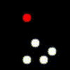

<head>
       
       
       
</head>

# Aim
The goal of this project is to explore the effects of using object properties and their interactions with each other on a reinforcement learning game agent. The goal of the agent is to achieve maximum lifetime rewards in the environment it is playing in. Through the course of this project, we want to augment Deep RL game playing agents with more information about objects in the game and how they interact.

# Motivation
Due to advances in deep neural networks, we are able to solve many RL problems ranging from games like Chess, Go, Atari, StarCraft to real world robotics and control tasks. Unfortunately, deep RL models still face many issues including overfitting to the large training data. Detecting object representations and modeling their interactions in unsupervised way might allow deep RL models to generalize better on unseen but statistically similar test data.

# Problem Formulation

## The RL Framework
Given an environment that outputs an observation $\bf{O_t}$ and reward $\bf{R_t}$ at every time step , take an action $\bf{A_t}$ in the environment to maximize the total discounted lifetime reward accumulated in the environment. The discounted lifetime reward is defined as: 

$$
\begin{equation} \label{eq:1}
 l = \bf{R_t} + \gamma \bf{R_{t+1}} + \gamma^2 \bf{R_{t+2}} + .....
\end{equation}
$$

where $\gamma$ is the discount factor, $\bf{R_t}$ is the immediate reward for at time $t$ and $\bf{R_{t+1}}$ is the reward at time $t+1$ and so on.

We use Deep Neural Networks to learn object properties, interactions and predict optimal actions in the environment given a set of previous observations $\bf{O_{t-k}} ... \bf{O_{t}}$. So, at every time-step, our algorithm outputs the best action to take to maximize equation (1). Figure 1 describes our problem setup in a schematic way.

       
        
       <em>Figure 1: Interaction between the environment and ROORL agent</em>

## Environment

Since we are designing a reinforcement learning agent, our data is derived from the environment. For the purpose of this project, we designed a new game environment for our game playing agent to play in. This environment hosts a simple game where balls collide with each other and the wall. There are five actions in the environment: no-op, left, right, up and down. No-op does no action for the time step and the other actions provide impulses to the ball controlled by network in the direction of the action. To enable the network to identify itself, we differentiate the ball controlled by the network and the other balls in the environment. The ball controlled by the network appears as a triangle whereas the other agents appear as circles. A video of the environment with five agents is shown in the figure.

       
        
       <em>Figure 2: Environment</em>

We created 2 tasks in this environment to train out agents: 
1. In task 1, we encourage collisions with balls and discourage collisions with walls: collision with another ball earns a reward of +1 while a collision with the wall earns a reward of +1.
2. In task 2, we discourage collisions with balls and encourage collisions with walls: collision with another ball earns a reward of -1 while a collision with the wall earns a reward of +1.

# Past Works

## Q-Learning
Q-Learning is an off-policy reinforcement learning algorithm to find optimal q-values for state-action pairs. For a state $s$ and action $a$, q-value for the pair while following a policy $\pi$ is defined as the expected reward we achieve if we take action $a$ and follow the same policy $\pi$.

$$
\begin{equation} \label{eq:2}
 Q_\pi(s_t, a_t) = \sum_{i=t}^{i=\infty} r_i * \gamma^i
\end{equation}
$$

Optimal q-value is the best possible q-value we can achieve while following an optimal policy $\pi^\*$

$$
\begin{equation} \label{eq:3}
 Q^*(s_t, a_t) = \max_{\pi} Q_\pi(s_t, a_t)
\end{equation}
$$

Q-Learning updates the q-values of state-action pairs while following an exploratory policy which is why it is called off-policy learning algorithm. Precisely, the update is,

$$
\begin{equation} \label{eq:4}
Q(s_t, a_t) = (1 - \alpha) * Q(s_t, a_t) + \alpha (r_t + \gamma * \max_a Q(s_{t+1}, a)) 
\end{equation}
$$

where $\alpha$ is the learning rate.

## DQN
DQN is a neural network architecture that uses Q-Learning to find the optimal policy. The network takes in certain number of images and outputs the q-values for all the actions. To simulate Q-Learning update, we use two copies of neural networks that are synced periodically. Only one copy is trained and the weights of the other copy is kept frozen. In addition, we also maintain a replay memory $R$ that stores transitions, $(s_t, a_t, r_t, s_{t+1})$ tuples from recent episodes. This along with maintaining two copies of network, makes the updates more stable.

During training, we sample a mini-batch of transitions $(s, a, r, s^{'})$ uniformly from the replay memory and define a loss,

$$
\begin{equation} \label{eq:5}
L(\theta_i) = E_{(s, a, r, s^{'}) \sim U(R) } \lbrack (r + \gamma * \max{_{a^{'}}} Q(s^{'}, a^{'}; \theta^-_i) - Q(s, a; \theta) \rbrack^{2}
\end{equation}
$$

where $\theta_i$ and $\theta_i^-$ are parameters of training network and frozen network respectively.

## DRQN
DRQN is the recurrent version of DQN where we use a recurrent neural network instead of a feed forward network to compute the q-values. This helps the network by maintaining an internal state to keep track of the game. During game-play, the state is propagated until the end of the episode after which it is zero initialized at the start of the next episode. While training the network, we unroll the RNN for some fixed time steps which is smaller than the episode length and train the q-values for this sequence.

## RNEM
Relational Neural Expectation Maximization(RNEM) is based on Neural Expectation maximization(NEM), a neural network architecture that learns a separate distributed representation for each object described in terms of the same features through an iterative process of perceptual grouping and representation learning. In addition to NEM algorithm, RNEM also models interactions between objects efficiently.

The goal of NEM is to group pixels in the input that belong to the same object (perceptual grouping) and capture this information efficiently in a distributed representation $$\theta_{k}$$ for each object. At a high-level, the idea is that if we were to have access to the family of distributions $$P(x$$\|$$\theta_{k})$$ (a statistical model of images given object representations $$\theta_{k}$$) then we can formalize our objective as inference in a mixture of these distributions. By using Expectation Maximization to compute a Maximum Likelihood Estimate (MLE) of the parameters of this mixture $$(\theta_{1}, . . . , \theta_{K})$$, we obtain a grouping (clustering) of the pixels to each object (component) and their corresponding representation. 

NEM models each image $\boldsymbol{x} \in \mathbb{R}^{D}$ as a spatial mixture of $K$ components parameterized by vectors $\theta_{1}, . . . , \theta_{K} \in \mathbb{R}^{M}$. A neural network $f_{\phi}$ is used to transform these representations $\theta_{k}$ into parameters $$\psi_{i,k} = f_{\phi}(\theta_{k})_{i}$$ for separate pixel-wise distributions. A set of binary latent variables $$Z \in [0, 1]_{D\times K}$$ encodes the unknown true pixel assignments, such that $$z_{i,k} = 1$$ iff pixel $i$ was generated by component $k$.

The full likelihood for $$x$$ given $$\theta = (\theta_{1}, . . . , \theta_{K})$$ is given by:

$$
\begin{equation} \label{eq:6}
P(\boldsymbol{x} | \boldsymbol{\theta}) = \prod_{i=1}^{D} \sum_{k=1}^{K} P\left(z_{i, k}=1\right) P\left(x_{i} | \psi_{i, k}, z_{i, k}=1\right)
\end{equation}
$$

Marginalization over $z$ complicates this process, thus RNEM uses generalized EM to maximize the following lower bound instead:

$$
\begin{equation} \label{eq:7}
\mathcal{Q}\left(\boldsymbol{\theta}, \boldsymbol{\theta}^{\text { old }}\right) = \sum_{\mathbf{z}} P\left(\mathbf{z} | \boldsymbol{x}, \boldsymbol{\psi}^{\text { old }}\right) \log P(\boldsymbol{x}, \mathbf{z} | \boldsymbol{\psi})
\end{equation}
$$

The unrolled computational graph of the generalized EM steps is differentiable, which provides a means to train $f_{\phi}$ to implement a statistical model of images given object representations. Using back-propagation through time, $f_{\phi}$ is trained to minimize the following loss:

$$
\begin{equation} \label{eq:8}
L(\boldsymbol{x})=-\sum_{i=1}^{D} \sum_{k=1}^{K} \underbrace{\gamma_{i, k} \log P\left(x_{i}, z_{i, k} | \psi_{i, k}\right)}_{\text { intra-cluster loss }} -\underbrace{\left(1-\gamma_{i, k}\right) D_{K L}\left[P\left(x_{i}\right) \| P\left(x_{i} | \psi_{i, k}, z_{i, k}\right)\right]}_{\text { inter-cluster loss }}
\end{equation}
$$

where $$\gamma_{i, k} =P $$ \( $$z_{i, k}=1$$ \| $$ x_{i}, \psi_{i}^{\text { old }}$$\) is calculated during E-step of the generalized EM algorithm.

Additionally, RNEM proposes a parametrized interaction function $$\Upsilon^{R-NEM}$$ that updates $$\theta_{k}$$ based on the pairwise effects of the objects $$i \neq k$$ on $$k$$:

$$
\boldsymbol{\theta}_{k}^{(t)}=\operatorname{RNN}\left(\tilde{\boldsymbol{x}}^{(t)}, \Upsilon_{k}^{\mathrm{R}-\mathrm{NEM}}\left(\boldsymbol{\theta}^{(t-1)}\right)\right)\\
\Upsilon_{k}^{\mathrm{R}-\mathrm{NEM}}(\boldsymbol{\theta})=\left[\hat{\boldsymbol{\theta}}_{k} ; \boldsymbol{E}_{k}\right] \text { with } \hat{\boldsymbol{\theta}}_{k}=\operatorname{MLP}^{e n c}\left(\boldsymbol{\theta}_{k}\right), \boldsymbol{E}_{k}=\sum_{i \neq k} \alpha_{k, i} \cdot \boldsymbol{e}_{k, i}\\
\alpha_{k, i}=\operatorname{MLP}^{a t t}\left(\xi_{k, i}\right), e_{k, i}=\operatorname{MLP}^{e f f}\left(\xi_{k, i}\right), \xi_{k, i}=\operatorname{MLP}^{e m b}\left(\left[\hat{\theta}_{k} ; \hat{\theta}_{i}\right]\right)\\
\text{where [·;·] is the concatenation operator and MLP(·) corresponds to a multi-layer perceptron.}
$$

# Related Work

[Deep reinforcement learning with relational inductive biases](https://openreview.net/forum?id=HkxaFoC9KQ) uses multi-head dot product attention mechanism to compute pairwise
interaction between each pair of entities. They use deep RL algorithm
based on a distributed advantage actor-critic(A2C) method to train
agents. Our work is different from this research, as we plan to use
expectation maximization based approach rather than attention mechanism
to model object properties and interactions.

[Binding via Reconstruction Clustering](https://arxiv.org/pdf/1511.06418.pdf) talks about creating disentangled and distributed representations and
uses a denoising auto-encoder to dynamically bind features together in
multi-object inputs through an Expectation-Maximization-like clustering
process. This work shares some similarity with RNEM in the way input is
modelled and the learning paradigm but it is limited by it’s application
to images unlike RNEM which is extensible to videos. Additionally, RNEM
also models interactions between objects.

[Neural relational inference for interacting systems](https://arxiv.org/pdf/1802.04687.pdf) proposes an unsupervised model that learns to infer interactions while
simultaneously learning the dynamics purely from observational data.
However, unlike RNEM it expects object features (e.g. location,
velocity) as part of observational data during training and initial
phase of testing to estimate interaction graph.

# ROORL: Relational Obejct-Oriented Reinforcement Learner

# Result

## Generalization experiments
### Changing the number of balls in the image

In this experiment, we changed the number of balls in the image from 2 - 10. All the agents were trained with 5 balls in the environment. We report the average reward from 100 episodes for each of the algorithm in the table below.

| Agent | k=2 | k=3 | k=4 | k=5 | k=6 | k=7 | k=8 | k=9 | k=10 |
| --- | --- | --- | --- | --- | --- | --- | --- | --- | --- |
| DQN | 9.9 | 11.8 | 12.5 | 14.3 | 16.5 | 15.9 | 18.0 | 20.2 | 21.4 |
| DRQN | 4.3 | 7.2 | 10.0 | 13.7 | 14.9 | 15.8 | 16.4 | 17.1 | 18.1 |
| ROORL | 0.6 | 4.2 | 7.3 | 8.9 | 12.0 | 14.5 | 16.8 | 18.4 | 20.2 |

| Agent | k=2 | k=3 | k=4 | k=5 | k=6 | k=7 | k=8 | k=9 | k=10 |
| --- | --- | --- | --- | --- | --- | --- | --- | --- | --- |
| DQN |  |  |  |  |  |  |  |  |  | 
| DRQN |  |  |  |  |  |  |  |  |  | 
| ROORL |  |  |  |  |  |  |  |  |  |

### Changing the size of balls in the image

In this experiment, we changed the the sizes of balls in the image from 0.08 - 0.12. All the agents were trained with ball size fixed at 0.10. We report the average reward from 100 episodes for each of the algorithm in the table below.

| Agent | d=0.08 | d=0.09 | d=0.11 | d=0.12 | 
| --- | --- | --- | --- | --- | 
| DQN | 7.2 | 11.2 | 13.3 | 13.5 |
| DRQN | 2.8 | 7.8 | 14.0 | 14.8 |
| ROORL | 4.0 | 7.8 | 10.0 | 9.7 |

| Algorithm | d=0.08 | d=0.09 | d=0.11 | d=0.12 | 
| --- | --- | --- | --- | --- | 
| DQN |  |  |   |   |
| DRQN |  |  |   |   |
| ROORL |  |  |   |   |

## Adversarial Experiments

In following experiments, We have only two agents in environment. We report the average reward from 100 episodes for each of the experiment in the table below.

Rewards are displayed in Agent 1 reward / Agent 2 reward format.

### Adversarial Experiment 1: Task 1 vs Task 1

Agent 1: trained for Task 1

Agent 2: trained for Task 1

#### Average Rewards:

| Agent 1/Agent 2 | DQN | DRQN | ROORL | 
| --- | --- | --- | --- |
| DQN | 13.7/13.6 | 12.8/12.9 | 10.3/6.9 |
| DRQN | 12.3/12.4 | 12.5/12.3 | 7.1/5.4 |
| ROORL | 7.8/10.6 | 6.1/7.3 | 4.6/4.4 |

#### Sample videos:

| Agent 1/Agent 2 | DQN | DRQN | ROORL | 
| --- | --- | --- | --- |
| DQN |  |  |  |
| DRQN |  |  |  |
| ROORL |  |  |  |

### Adversarial Experiment 2: Task 1 vs Task 2

Agent 1: trained for Task 1

Agent 2: trained for Task 2

#### Average Rewards:

| Agent 1/Agent 2 | DQN | DRQN | ROORL | 
| --- | --- | --- | --- |
| DQN | 1.2/54.0 |  1.4/52.8 | 5.6/20.2 |
| DRQN | 0.5/54.4 | 0.3/57.8 | 0.9/21.6 |
| ROORL | 6.9/23.9 | 6.7/35.7 | -1.4/23.9 |

#### Sample videos:

| Agent 1/Agent 2 | DQN | DRQN | ROORL | 
| --- | --- | --- | --- |
| DQN |  |  |  |
| DRQN |  |  |  |
| ROORL |  |  |  |

# image holder

