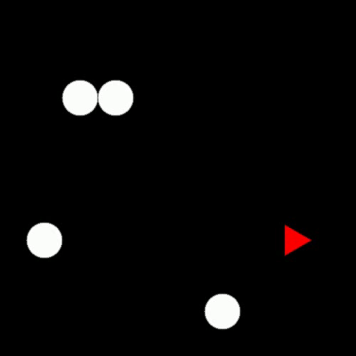

## Aim
The goal of this project is to explore the effects of using object properties and their interactions witheach other on a reinforcement learning game agent.  The goal of the agent is to achieve maximumlifetime rewards in the environment it is playing in.  Through the course of this project, we want toaugment Deep RL game playing agents with more information about objects in the game and howthey interact.

## Motivation
Due to advances in deep neural networks,  we are able to solve many RL problems ranging fromgames  like  Chess,  Go,  Atari,  StarCraft  to  real  world  robotics  and  control  tasks.   Unfortunately,deep RL models still face many issues including over-fitting to the large training data.  Detectingobject representations and modeling their interactions in unsupervised way might allow deep RLmodels to generalize better on unseen but statistically similar test data.

## Problem Formulation
Given an environment that outputs an observationOtand rewardRtat every time stept, take anactionAtin the environment to maximize the total discounted lifetime reward accumulated in theenvironment.  The discounted lifetime reward is defined as:l=Rt+γRt+1+γ2Rt+2+.....(1)whereγis the discount factorRtis the immediate reward for at timetandRt+1is the reward attimet+ 1 and so on.We plan to use Deep Neural Networks to learn object properties, interactions and predict optimalactions in the environment given a set of previous observationsOt−k...Ot.  So, at every time-step,our algorithm outputs the best action to take to maximize equation (1).  Figure (1) describes ourproblem setup in a schematic way.

## Past Works and Baselines

## Approach - What is ROORL?

## Result

