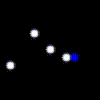

<head>
       
       
       
</head>

# Aim
The goal of this project is to explore the effects of using object properties and their interactions with each other on a reinforcement learning game agent. The goal of the agent is to achieve maximum lifetime rewards in the environment it is playing in. In the course of this project, we augmented Deep RL game playing agents with more information about objects in the game and how they interact.

# Motivation
Due to advances in deep neural networks, we are able to solve many RL problems ranging from games like Chess, Go, Atari, StarCraft to real world robotics and control tasks. Unfortunately, deep RL models still face many issues including overfitting to the large training data and poor generalization. Detecting object representations and modeling their interactions in unsupervised way might allow deep RL models to generalize better on unseen but statistically similar test data.

# Problem Formulation

## A. The RL Framework
Given an environment that outputs an observation $\bf{O_t}$ and reward $\bf{R_t}$ at every time step , take an action $\bf{A_t}$ in the environment to maximize the total discounted lifetime reward accumulated in the environment. The discounted lifetime reward is defined as: 

$$
\begin{equation} \label{eq:1}
 l = \bf{R_t} + \gamma \bf{R_{t+1}} + \gamma^2 \bf{R_{t+2}} + .....
\end{equation}
$$

where $\gamma$ is the discount factor, $\bf{R_t}$ is the immediate reward for at time $t$ and $\bf{R_{t+1}}$ is the reward at time $t+1$ and so on.

We use Deep Neural Networks to predict optimal actions in the environment given a set of previous observations $\bf{O_{t-k}} ... \bf{O_{t}}$. So, at every time-step, our algorithm outputs the best action to take to maximize equation (1). Following image describes our problem setup in a schematic way.

       
        
       <em>Interaction between the environment and ROORL agent</em>

## B. Environment

Since we are designing a reinforcement learning agent, our data is derived from the environment. For the purpose of this project, we designed a new game environment for our game-playing agent to play in. This environment hosts a simple game where balls collide with each other and are confined by four walls. There are five actions in the environment: no-op, left, right, up and down. No-op does no action for the time step and the other actions provide impulses to the ball controlled by network in the direction of the action. To enable the network to identify itself, we differentiate the ball controlled by the network and the other balls in the environment. The ball controlled by the network appears as a triangle whereas the other agents appear as circles. The video below shows our environment setting.

       
        
       <em>Environment</em>

To help us understand the behavior of different algorithms, we created 2 tasks in this environment to train our agents in: 
1. In Task 1, we encourage collisions with balls and discourage collisions with walls: collision with another ball earns a reward of +1 while a collision with walls earn a reward of -1.
2. In Task 2, we discourage collisions with balls and encourage collisions with walls: collision with another ball earns a reward of -1 while a collision with the walls earn a reward of +1.

# Past Works

## A. Q-Learning
Q-Learning is an off-policy reinforcement learning algorithm to find optimal q-values for state-action pairs. For a state $s$ and action $a$, q-value for the pair while following a policy $\pi$ is defined as the expected reward we achieve if we take action $a$ and follow the same policy $\pi$.

$$
\begin{equation} \label{eq:2}
 Q_\pi(s_t, a_t) = \sum_{i=t}^{i=\infty} r_i * \gamma^i
\end{equation}
$$

Optimal q-value is the best possible q-value we can achieve while following an optimal policy $\pi^\*$

$$
\begin{equation} \label{eq:3}
 Q^*(s_t, a_t) = \max_{\pi} Q_\pi(s_t, a_t)
\end{equation}
$$

Q-Learning updates the q-values of state-action pairs while following an exploratory policy. Precisely, the update is,

$$
\begin{equation} \label{eq:4}
Q(s_t, a_t) = (1 - \alpha) * Q(s_t, a_t) + \alpha (r_t + \gamma * \max_a Q(s_{t+1}, a)) 
\end{equation}
$$

where $\alpha$ is the learning rate.

## B. DQN
[DQN](https://web.stanford.edu/class/psych209/Readings/MnihEtAlHassibis15NatureControlDeepRL.pdf) is a neural network architecture that uses Q-Learning to find the optimal policy. The network takes in certain number of images and outputs the q-values for all the actions. To simulate Q-Learning update, we use two copies of neural networks that are synced periodically. Only one copy is trained and the weights of the other copy are kept frozen. In addition, we also maintain a replay memory $R$ that stores transitions, $(s_t, a_t, r_t, s_{t+1})$ tuples from recent episodes. This along with maintaining two copies of network, makes the updates more stable.

During training, we sample a mini-batch of transitions $(s, a, r, s^{'})$ uniformly from the replay memory and define a loss,

$$
\begin{equation} \label{eq:5}
L(\theta_i) = E_{(s, a, r, s^{'}) \sim U(R) } \lbrack (r + \gamma * \max{_{a^{'}}} Q(s^{'}, a^{'}; \theta^-_i) - Q(s, a; \theta) \rbrack^{2}
\end{equation}
$$

where $\theta_i$ and $\theta_i^-$ are parameters of training network and frozen network respectively.

## C. DRQN
[DRQN](https://arxiv.org/pdf/1507.06527.pdf) is the recurrent version of DQN where we use a recurrent neural network instead of a feed forward network to compute the q-values. This helps the network by maintaining an internal state to keep track of the game. During game-play, the state is propagated until the end of the episode after which it is zero initialized at the start of the next episode. While training the network, we unroll the RNN for some fixed time steps which is smaller than the episode length and train the q-values for this sequence.

## D. RNEM
[Relational Neural Expectation Maximization(RNEM)](https://arxiv.org/pdf/1802.10353.pdf) is based on [Neural Expectation maximization(NEM)](https://arxiv.org/pdf/1708.03498.pdf), a neural network architecture that learns a separate distributed representation for each object described in terms of the same features through an iterative process of perceptual grouping and representation learning. In addition to NEM algorithm, RNEM also models interactions between objects efficiently.

The goal of NEM is to group pixels in the input that belong to the same object (perceptual grouping) and capture this information efficiently in a distributed representation $$\theta_{k}$$ for each object. At a high-level, the idea is that if we were to have access to the family of distributions $$P(x$$\|$$\theta_{k})$$ (a statistical model of images given object representations $$\theta_{k}$$) then we can formalize our objective as inference in a mixture of these distributions. By using Expectation Maximization to compute a Maximum Likelihood Estimate (MLE) of the parameters of this mixture $$(\theta_{1}, . . . , \theta_{K})$$, we obtain a grouping (clustering) of the pixels to each object (component) and their corresponding representation. 

NEM models each image $\boldsymbol{x} \in \mathbb{R}^{D}$ as a spatial mixture of $K$ components parameterized by vectors $\theta_{1}, . . . , \theta_{K} \in \mathbb{R}^{M}$. A neural network $f_{\phi}$ is used to transform these representations $\theta_{k}$ into parameters $$\psi_{i,k} = f_{\phi}(\theta_{k})_{i}$$ for separate pixel-wise distributions. A set of binary latent variables $$Z \in [0, 1]_{D\times K}$$ encodes the unknown true pixel assignments, such that $$z_{i,k} = 1$$ iff pixel $i$ was generated by component $k$.

The full likelihood for $$x$$ given $$\theta = (\theta_{1}, . . . , \theta_{K})$$ is given by:

$$
\begin{equation} \label{eq:6}
P(\boldsymbol{x} | \boldsymbol{\theta}) = \prod_{i=1}^{D} \sum_{k=1}^{K} P\left(z_{i, k}=1\right) P\left(x_{i} | \psi_{i, k}, z_{i, k}=1\right)
\end{equation}
$$

Marginalization over $z$ complicates this process, thus RNEM uses generalized EM to maximize the following lower bound instead:

$$
\begin{equation} \label{eq:7}
\mathcal{Q}\left(\boldsymbol{\theta}, \boldsymbol{\theta}^{\text { old }}\right) = \sum_{\mathbf{z}} P\left(\mathbf{z} | \boldsymbol{x}, \boldsymbol{\psi}^{\text { old }}\right) \log P(\boldsymbol{x}, \mathbf{z} | \boldsymbol{\psi})
\end{equation}
$$

The unrolled computational graph of the generalized EM steps is differentiable, which provides a means to train $f_{\phi}$ to implement a statistical model of images given object representations. Using back-propagation through time, $f_{\phi}$ is trained to minimize the following loss:

$$
\begin{equation} \label{eq:8}
L(\boldsymbol{x})=-\sum_{i=1}^{D} \sum_{k=1}^{K} \underbrace{\gamma_{i, k} \log P\left(x_{i}, z_{i, k} | \psi_{i, k}\right)}_{\text { intra-cluster loss }} -\underbrace{\left(1-\gamma_{i, k}\right) D_{K L}\left[P\left(x_{i}\right) \| P\left(x_{i} | \psi_{i, k}, z_{i, k}\right)\right]}_{\text { inter-cluster loss }}
\end{equation}
$$

where $$\gamma_{i, k} =P $$ \( $$z_{i, k}=1$$ \| $$ x_{i}, \psi_{i}^{\text { old }}$$\) is calculated during E-step of the generalized EM algorithm.

Additionally, RNEM proposes a parametrized interaction function $$\Upsilon^{R-NEM}$$ that updates $$\theta_{k}$$ based on the pairwise effects of the objects $$i \neq k$$ on $$k$$:

$$
\boldsymbol{\theta}_{k}^{(t)}=\operatorname{RNN}\left(\tilde{\boldsymbol{x}}^{(t)}, \Upsilon_{k}^{\mathrm{R}-\mathrm{NEM}}\left(\boldsymbol{\theta}^{(t-1)}\right)\right)\\
\Upsilon_{k}^{\mathrm{R}-\mathrm{NEM}}(\boldsymbol{\theta})=\left[\hat{\boldsymbol{\theta}}_{k} ; \boldsymbol{E}_{k}\right] \text { with } \hat{\boldsymbol{\theta}}_{k}=\operatorname{MLP}^{e n c}\left(\boldsymbol{\theta}_{k}\right), \boldsymbol{E}_{k}=\sum_{i \neq k} \alpha_{k, i} \cdot \boldsymbol{e}_{k, i}\\
\alpha_{k, i}=\operatorname{MLP}^{a t t}\left(\xi_{k, i}\right), e_{k, i}=\operatorname{MLP}^{e f f}\left(\xi_{k, i}\right), \xi_{k, i}=\operatorname{MLP}^{e m b}\left(\left[\hat{\theta}_{k} ; \hat{\theta}_{i}\right]\right)\\
\text{where [·;·] is the concatenation operator and MLP(·) corresponds to a multi-layer perceptron.}
$$

# Related Works

[Deep reinforcement learning with relational inductive biases](https://openreview.net/forum?id=HkxaFoC9KQ) uses multi-head dot product attention mechanism to compute pairwise
interaction between each pair of entities. They use deep RL algorithm
based on a distributed advantage actor-critic(A2C) method to train
agents. Our work is different from this research, as we plan to use
expectation maximization based approach rather than attention mechanism
to model object properties and interactions.

[Binding via Reconstruction Clustering](https://arxiv.org/pdf/1511.06418.pdf) talks about creating disentangled and distributed representations and
uses a denoising auto-encoder to dynamically bind features together in
multi-object inputs through an Expectation-Maximization-like clustering
process. This work shares some similarity with RNEM in the way input is
modelled and the learning paradigm but it is limited by it’s application
to images unlike RNEM which is extensible to videos. Additionally, RNEM
also models interactions between objects.

[Neural relational inference for interacting systems](https://arxiv.org/pdf/1802.04687.pdf) proposes an unsupervised model that learns to infer interactions while
simultaneously learning the dynamics purely from observational data.
However, unlike RNEM it expects object features (e.g. location,
velocity) as part of observational data during training and initial
phase of testing to estimate interaction graph.

# ROORL: Relational Obejct-Oriented Reinforcement Learner

ROORL extends RNEM by using object properties and interactions to predict q-values. In our joint architecture, we use the RNEM network structure to explicitly learn object oriented properties and interactions. Then we use a simple graph network to obtain the q-values from hidden states which we call the "Max Pool Network". The network first projects the hidden state onto a higher dimension and then does a max pool operation. Then we use a fully-connected layer to map it to q-values for the five actions. A schematic diagram that explains our joint architecure 1-step rollout is shown below.

       
        
       <em>1-step rollout of ROORL Architecture </em>

Training happens jointly by defining a joint loss function that is a weighted combination of RNEM and Q-Learning loss. Such weighting is necessary because the range of the two loss functions are drastically different. This weight is a hyperparameter to be tuned.

$$
\begin{equation} \label{eq:10}
L = \alpha L_{QL} + (1-\alpha) L_{RNEM}
\end{equation}
$$

# Training and Experiments

## A. Training on Task1 and Task2

We trained DQN, DRQN, ROORL models in our environment for 40000 unique episodes. Since there is no end to the game, we limit each episode to a fixed length of 250 time steps. For the experiments mentioned in this subsection, we used five balls where one of the balls is controlled by our agent.  All the other balls followed a fixed policy where they continue to move in their path until they collide with the wall or other balls.  Image observation size was kept at **48x48** to train the networks faster. Please refer to **Appendix A** for detailed hyperparameters.

For  DQN,  we  use  four  consecutive  time  steps  as  input  to  the  neural  network  to  make  this environment  an  MDP  like  in  the  original  DQN  paper.   The  network  infers  the  state  from  these four observations and outputs q-values for all the actions.  This input is propagated through three convolution layers followed by two fully connected layers.  We use ReLU non-linearity after all layersexcept for the last one. In  the  case  of  DRQN,  we  only  input  current  observation  to  the  neural  network  because  the network internally maintains a state that can be used to infer the current state of the game.  The network structure remains the same as DQN except we replace the first fully connected layer with an LSTM. ROORL consists of a convolutional encoder and decoder along with a recurrent relational cell that operates on the encoded hidden state as described in equations **(6), (7), (8)** and **(9)**. For ROORL, we use batch normalization like in the original implementation of RNEM. All three networks are trained similarly in an episodic way with BPTT for 25 time steps. After each episode we train the network for a fixed number of times(train frequency) and then continue to play the next episode.

Training rewards averaged across 100 episodes for the three models on Task 1 and Task 2 are reported in following graphs:

#### i. Explanation

As we can see from the first graph, our agent achieves rewards comparable to the two baselines we implemented for Task 1 even when it was trained **10 times lesser** than DQN and DRQN(**train frequency 5 vs train frequency 50**). However, it does not achieve comparable rewards on Task 2. We suspect that this has to do with the lower train frequency for ROORL which prohibited the network from finding the optimal policy for this task.

## B. Episode Rollout

To make sure that our model is learning object representations properly, we constructed episode rollout plots for ROORL and compared it to RNEM. The plot depicts (starting from the bottom): the actual input to the network, **k** consecutive rows of cluster means for **k** objects, color coded $$\gamma$$ values for each time-step, next-frame prediction by the nextwork and finally the ground-truth next frame. 

       <em> RNEM rollout for one episode </em>
        
       
        
        
       <em> ROORL rollout for one episode </em>
        
       
        

#### i. Explanation

We observe that representations learnt by ROORL are not as good as plain RNEM. This is because we are also trying to store some information about playing in environment in $\theta_{k}$ via Q-Learning loss. Since object representations in the episode rollout are generated from $\gamma_{k}$ (which are generated from $\theta_{k}$), visual object representations are not as good as plain RNEM.

## C. Generalization experiments
### 1. Changing the number of balls in the image

In this experiment, we changed the number of balls in the image from 2 - 10. All the agents were trained with 5 balls in the environment. We report the average reward from 100 episodes for each of the algorithm in the table below.

#### i. Average Rewards
       
| Agent | k=2 | k=3 | k=4 | k=5 | k=6 | k=7 | k=8 | k=9 | k=10 |
| :---: | :---: | :---: | :---: | :---: | :---: | :---: | :---: | :---: | :---: |
| DQN | 9.9 | 11.8 | 12.5 | 14.3 | 16.5 | 15.9 | 18.0 | 20.2 | 21.4 |
| DRQN | 4.3 | 7.2 | 10.0 | 13.7 | 14.9 | 15.8 | 16.4 | 17.1 | 18.1 |
| ROORL | 0.6 | 4.2 | 7.3 | 8.9 | 12.0 | 14.5 | **16.8** | **18.4** | **20.2** |

#### ii. Sample videos

| Agent | k=2 | k=3 | k=4 | k=5 | k=6 | k=7 | k=8 | k=9 | k=10 |
| :---: | :---: | :---: | :---: | :---: | :---: | :---: | :---: | :---: | :---: |
| DQN |  |  |  |  |  |  |  |  |  | 
| DRQN |  |  |  |  |  |  |  |  |  | 
| ROORL |  |  |  |  |  |  |  |  |  |

#### iii. Explanation

As the value of **k** increases from **k** = 5  to **k** = 10, ROORL agent seems to perform better than DQN and DRQN agents. However, for **k** < 5, DQN agent seems to perform best. Based on analyzing videos and q-values, we believe that ROORL agent takes some time to learn good representation of objects during initial steps of episode rollout, which causes ROORL agent to chase after the other balls. Since environment has few balls with an upper limit to maximum speed, ROORL agent is not able to achieve higher rewards.

### 2. Changing the size of balls in the image

In this experiment, we changed the the sizes of balls in the image from 0.08 - 0.12. All the agents were trained with ball size fixed at 0.10. We report the average reward from 100 episodes for each of the algorithm in the table below.

#### i. Average Rewards

| Agent | r=0.08 | r=0.09 | r=0.11 | r=0.12 | 
| :---: | :---: | :---: | :---: | :---: | 
| DQN | 7.2 | 11.2 | 13.3 | 13.5 |
| DRQN | 2.8 | 7.8 | 14.0 | 14.8 |
| ROORL | **4.0** | **7.8** | 10.0 | 9.7 |

#### ii. Sample video

| Agent | r=0.08 | r=0.09 | r=0.11 | r=0.12 | 
| :---: | :---: | :---: | :---: | :---: | 
| DQN |  |  |   |   |
| DRQN |  |  |   |   |
| ROORL |  |  |   |   |

#### iii. Explanation

DQN agent outperforms DRQN and RNEM agent for changing ball sizes. However, ROORL agent outperforms DRQN agent for smaller ball sizes.

## D. Adversarial Experiments

In following experiments, we have only two balls in environment. Both the balls are controlled by different algorithms trained on different tasks. We report the average reward from 100 episodes for each of the experiment in the table below.

Rewards are displayed in Agent 1 reward / Agent 2 reward format.

### 1. Adversarial Experiment 1: Task 1 vs Task 1

**Agent 1: trained for Task 1**
**Agent 2: trained for Task 1**

#### i. Average Rewards

| Agent 1/Agent 2 | DQN | DRQN | ROORL | 
| :---: | :---: | :---: | :---: |
| DQN | 13.7/13.6 | 12.8/12.9 | 10.3/6.9 |
| DRQN | 12.3/12.4 | 12.5/12.3 | 7.1/5.4 |
| ROORL | 7.8/10.6 | 6.1/7.3 | 4.6/4.4 |

#### ii. Sample videos

| Agent 1/Agent 2 | DQN | DRQN | ROORL | 
| :---: | :---: | :---: | :---: |
| DQN |  |  |  |
| DRQN |  |  |  |
| ROORL |  |  |  |

#### iii. Explanation

For adversarial experiment 1, there doesn’t seem to be a clear winner between DQN and DRQN. Even though ROORL agent is not able to outperform DQN or DRQN, rewards achieved by ROORL agent is closer to their opponent.

### 2. Adversarial Experiment 2: Task 1 vs Task 2

**Agent 1: trained for Task 1**
**Agent 2: trained for Task 2**

#### i. Average Rewards

| Agent 1/Agent 2 | DQN | DRQN | ROORL | 
| :---: | :---: | :---: | :---: |
| DQN | 1.2/54.0 |  1.4/52.8 | 5.6/20.2 |
| DRQN | 0.5/54.4 | 0.3/57.8 | 0.9/21.6 |
| ROORL | **6.9/23.9** | **6.7/35.7** | -1.4/23.9 |

#### ii. Sample videos

| Agent 1/Agent 2 | DQN | DRQN | ROORL | 
| :---: | :---: | :---: | :---: |
| DQN |  |  |  |
| DRQN |  |  |  |
| ROORL |  |  |  |

#### iii. Explanation

For adversarial experiment 2, when agent 1 (playing task 1) is ROORL, it’s able to achieve highest rewards while giving away lowest rewards to agent 2 compared to DQN and DRQN playing task 1. From the sample videos, we can observe that both DQN and DRQN freeze if the other agent backs into a corner and stops moving. But our ROORL agent is able to identity an object in this situation and enforces collisions thereby earning more rewards than the baselines.

# Conclusion and Future work

In this work, we developed an object-oriented RL agent based on relational neural expectation maximization and Q-learning. Our agent is able to learn good object representations without any supervision through neural expectation maximization and predicts q-values to play in the environment. It is able to outperform baselines in some Generalization experiments and in Adversarial experiment 2. Currently, we are training the ROORL architecture where we use a more complex Graph Neural Network instead of Max Pool Network.

Based on analysis of q-values, we conclude that our agent has not converged on optimal q-values when trained for 40000 episodes with train frequency 5. We plan to tune hyperparameters like training frequency, loss weights, learning rate scheduler for the agent to achieve faster convergence and better rewards.

Another avenue of interest is the exploration scheme for q-learning. In the current scheme, the exploration dies down to epsilon 0.1 by 20000th episode. Based on training rewards and loss analysis, we concluded that ROORL agent takes approximately 15000 episodes to learn good object representations. Since the Q-network relies on good object representations, it’s left with very little time to explore in the environment after good representations are learnt. So, we plan to re-do some experiments by letting our agent explore for more episodes.

Currently, in ROORL architecture, we are backpropagating gradients from Q-network to $\theta_{k}$ because we want $\theta_{k}$ to store information about playing in the environment. We are also planning to do experiments where the RNEM architecture is detached (explicitly blocking any gradients from Q-network to RNEM cell) from Q-network during backpropagation. We also plan to train ROORL agent using $\gamma_{k}$ along with $\theta_{k}$ to predict q-values.

# Appendix A: Hyperparameters

| Hyperparameter | DQN | DRQN | ROORL | Description |
| :---: | :---: | :---: | :---: | :---: |
| balls | 5 | 5 | 5 | number of balls in the frame |
| minibatch size | 32 | 32 | 32 | number of training samples |
| training episodes | 40000 | 40000 | 40000 | total number of episode to train the network|
| replay memory size | 4000 | 4000 | 4000 | number of episodes to hold in the memory |
| replay memory initialization | 200 | 200 | 200 | number of episodes before we start training|
| target update frequency | 50 | 50 | 50 | number of episodes between updating the target network|
| epsilon start | 1.0 | 1.0 | 1.0 | initial epsilon for the policy|
| epsilon end | 0.1 | 0.1 | 0.1 | final epsilon for the policy|
| epsilon decay episodes | 20000 | 20000 | 20000 | number of episodes to decay epsilon |
| discount factor | 0.99 | 0.99 | 0.99 | discount factor $\gamma$ for Q-Learning update|
| optimizer | adam | adam | adam | Adam optimizer|
| learning rate | 0.0001 | 0.0001 | MultiStepLR Scheduler | learning rate for the optimizer|
| train frequency | 50 | 50 | 5 | number of training steps after each episode|
| stacked frames | 4 | - | - | number of frames to input the neural network|
| unroll | - | 25 | 25 | number of steps to unroll the recurrent block while training|

# Appendix B: Contribution

| Task | Contributors |
| :---: | :---: |
| Literature survey | Prathik, Dweep |
| Implementing game environment for custom games | Dweep |
| Implementing and training DQN in PyTorch | Prathik |
| Implementing and training DRQN in PyTorch | Prathik |
| Implementing and training RNEM in PyTorch | Dweep |
| Designing and Implementing ROORL agent | Prathik, Dweep |
| Experimenting on DQN, DRQN, ROORL agents | Prathik, Dweep |
| Writing poster and blog | Prathik, Dweep |
